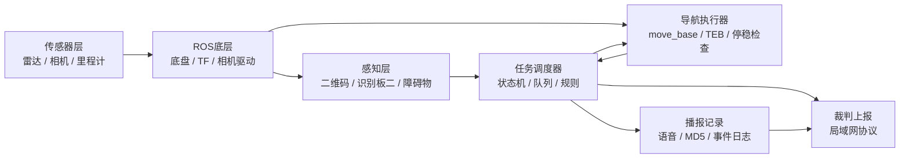
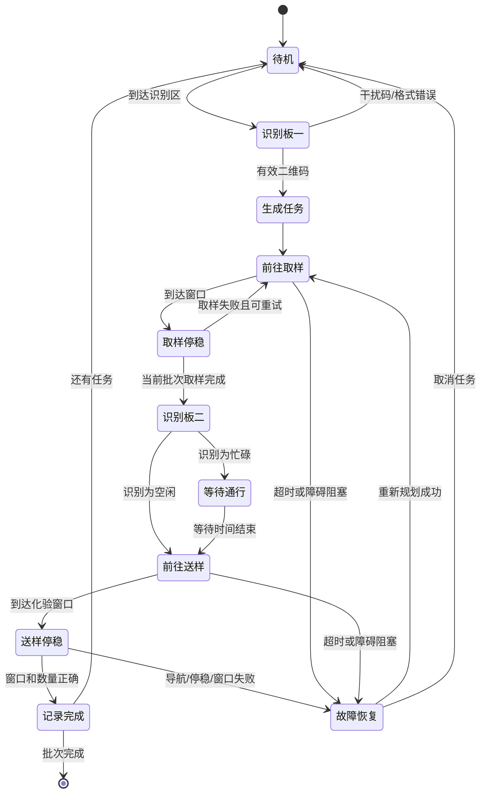

# 智慧医运机器人项目分析

_基于 `F1` 资料目录、比赛规则、EPRobot V2 手册和现有源码的第一版方案，用于团队评审。_

---

## 📋 结论摘要

这个项目应先完成一条可观测、可复现的最小闭环：

```text
小车联网 -> ROS 底层正常 -> 雷达建图/定位 -> 识别板一二维码 -> 生成任务队列
       -> 到取样窗口停稳 -> 到识别板二判断通行 -> 避障到化验窗口 -> 记录结果并上报
```

当前最重要的判断有四个：

1. **网络连接已经不是项目的主要风险**。小车默认作为 ROS 主机，Ubuntu 虚拟机作为 ROS 从机；后续必须保持两端 IP、`/etc/hosts` 和 ROS 环境变量一致。
2. **现有代码不是本次比赛的完整答案**。`src20251017.zip` 里的 `F1_demo.py` 主要是固定点跑圈和进站；`信安源码.zip` 已有二维码识别、取送流程、MD5 和 socket 示例，但仍使用旧场地坐标、旧相机地址和旧协议假设。
3. **第一版不应该直接让车自动跑完整任务**。应先把识别结果发布成结构化 ROS 消息，再由任务调度器消费；这样视觉误识别、导航失败和任务状态可以分别定位。
4. **比赛得分取决于停稳、识别、语音和数据完整性**，不是只要导航到大致位置即可。规则要求车身进入窗口、明显停留，并在规定时间内完成无人干预任务。

## 🎯 比赛目标拆解

比赛规则文件是 `F1/智能安全赛—智慧医运机器人对抗.docx`。它要求 Ubuntu 18.04、ROS 和阿克曼底盘，在约 `4.5 m x 4.5 m` 场地中完成样本配送。核心任务如下：

| 任务 | 输入 | 机器人动作 | 可验证结果 |
| --- | --- | --- | --- |
| 识别板一 | 含样本信息的二维码，可能有干扰码 | 识别有效二维码，判断 A/B/C 和样本类别 | 输出结构化任务，不接受伪造/遮挡/格式错误样本 |
| 取样 | A、B、C 体检窗口 | 按任务队列到窗口停稳并完成取样 | 车身进入框内，停留约 1–2 秒，样本数正确 |
| 识别板二 | 化验区空闲或“忙碌中，等待 n 秒” | OCR/图像识别状态，播报并等待或快速通过 | 空闲时约 3 秒内通过；忙碌时等待 n 秒 |
| 送样 | 化验窗口 1–4 | 按样本类型配送至对应窗口 | 送达窗口正确，样本数量和顺序正确 |
| 状态上报 | 速度、里程、视觉结果、位置、当前任务 | 通过局域网传到裁判系统 | 协议、频率和字段以赛方最终发布为准 |

评分中，单次配送、一次配送多个样本、干扰样本识别、避开移动障碍、正确播报和 MD5 校验都分别计分；碰撞、未停入框和样本堆积会扣分。因此调度器必须保存每一步的证据，而不能只保存“成功/失败”。

## 🧭 系统架构建议

建议把代码分成“感知、决策、执行、记录”四层。小车上的 ROS 节点负责底层传感器和运动，虚拟机主要用于 RViz、调试和上位机程序；最终比赛运行方式要根据赛方是否允许上位机通信确定。



建议的 ROS 包边界：

| 包/模块 | 责任 | 不负责的内容 |
| --- | --- | --- |
| `medical_perception` | 相机订阅、二维码定位、样本解析、识别板二状态识别 | 不发布运动指令 |
| `medical_task` | 任务队列、取样/送样状态机、超时和失败重试 | 不处理图像像素 |
| `medical_navigation` | 地图、定位、导航目标、停稳判定、避障参数 | 不决定样本业务规则 |
| `medical_audio` | 统一语音接口和播报队列 | 不直接改变任务状态 |
| `medical_report` | 事件日志、MD5、裁判协议适配 | 不控制底盘 |
| `medical_bringup` | 比赛启动文件和参数集合 | 不包含业务算法 |

## 📚 F1 资料盘点

### 比赛和产品文档

| 资料 | 作用 | 结论 |
| --- | --- | --- |
| `智能安全赛—智慧医运机器人对抗.docx` | 当前比赛规则 | 任务、得分、扣分、报告和状态上报的唯一业务依据 |
| `ROS小车使用说明书及源码/EPRobotV2智能小车使用手册-20260714.pdf` | 硬件、网络、ROS 操作 | 默认热点 `NCUT-EPRobot`，小车常用地址 `192.168.12.1`；手册强调 ROS 多机通信配置 |
| `竞赛程序说明.docx` | 旧版跑圈/F1 程序说明 | 可参考建图、取点和启动方式，不能直接当本次任务逻辑 |
| `智能车设备保养手册.docx` | 设备维护 | 比赛前检查电池、雷达、相机、底盘和线缆 |
| `树莓派系统镜像/更新说明_必须阅读.txt` | 镜像和功能包版本 | 资料中有 `V2.4` 和紫色控制板专用更新，必须核对实际硬件版本 |

### 源码和参数

| 资料 | 已发现内容 | 使用策略 |
| --- | --- | --- |
| `ROS小车使用说明书及源码/src20251017.zip` | `eprobot_start`、`robot_navigation`、`simple_navigation_goals`、`smart_pharmacy`、相机和雷达驱动 | 作为 ROS 启动、导航参数和话题名称的参考基线 |
| `ROS小车使用说明书及源码/信安源码.zip` | `detect_code_1017.py`、`Server_1017.py`、`Client_1017.py`、`F1_yaofang0718.py` | 重点提取二维码识别、MD5、socket 和调度思路，重写接口和配置 |
| `ROS小车使用说明书及源码/teb调整-F1参数.txt` | TEB、代价地图、障碍物距离参数 | 作为避障初始参数，必须在实际场地重新标定 |
| `智慧药房竞赛代码指导视频-内部/*.mp4` | 地图导入、编译、取点、调参、跑圈、语音演示 | 先人工观看关键片段，确认供应商推荐启动顺序 |
| `小车课程资料/教学视频/*.mp4` | ROS 多机通信、功能说明、源码讲解 | 用于补齐操作流程，不作为代码事实来源 |

### 已发现的不可直接复用点

- 旧源码的 `F1_demo.py` 使用固定地图坐标和固定目标点，必须替换为实际比赛场地坐标。
- `信安源码` 中二维码识别脚本出现 `192.168.166.248` 和 `192.168.166.27` 等旧相机流地址，不能假设当前小车仍使用这些地址。
- 旧调度程序通过 `/cam_return` 传递 `Int32MultiArray`，数组含义依赖隐式约定；本项目应改为带字段名、时间戳和置信度的消息。
- 旧源码把 A/B/C 以及组合样本的 MD5 写死在代码中；本项目应统一由样本字符串计算，并保存原始识别文本、规范化文本和 MD5。
- `Server_1017.py`/`Client_1017.py` 使用端口 `7000` 的 socket 示例，目标地址和通信协议尚未证明与本次裁判系统一致，不能直接启用。
- 现有导航参数中有 `TEB` 的 `min_obstacle_dist`、`inflation_dist` 等示例值；动态障碍场景需要实测，不应只照抄配置。

## 🔄 运行流程设计

任务调度器建议使用显式状态机。每个状态都要有进入条件、超时、取消动作和日志事件。



关键数据对象建议如下：

```text
SampleTask
  id: 唯一任务编号
  source_windows: [A, B, C]
  sample_type: blood/plasma/saliva/tissue
  target_window: 1/2/3/4
  raw_detection: 原始识别文本
  md5: 规范化样本字符串的 MD5
  confidence: 视觉置信度
  status: pending/picked/delivered/failed
  timestamps: 每个阶段的时间
```

## 🧪 分阶段实施计划

### 阶段 0：环境和基线

目标是证明系统可运行，而不是完成比赛任务。

- 记录小车、虚拟机和控制板版本。
- 验证 `ssh EPRobot@192.168.12.1`。
- 启动底盘后确认 `/tf`、`/odom`、`/cmd_vel`、`/scan`。
- 确认相机型号、图像话题、分辨率和帧率。
- 确认 ROS master、主机名、`/etc/hosts` 和 `ROS_MASTER_URI`/`ROS_IP`。
- 记录电池电压；蜂鸣器低电量提示不能在未确认电池状态前屏蔽。

阶段出口：能在 RViz 看到雷达和机器人位姿，能通过安全的低速方式让车移动并立即停止。

### 阶段 1：地图、定位和停稳

- 用实际比赛场地建图，保存 `map.yaml` 和 `map.pgm`。
- 在地图中记录识别板一、识别板二、A/B/C 和 1–4 窗口的位姿。
- 每个窗口增加“进入框内”和“停稳”检测，不只依赖 `move_base` 返回成功。
- 先在无样本、无动态障碍条件下连续完成多次点到点导航。

阶段出口：同一目标重复导航，位置误差、朝向误差和停留时间满足比赛要求。

### 阶段 2：视觉识别

- 先离线保存相机帧，独立验证识别板一定位框和二维码解码。
- 再封装成 ROS 节点，发布结构化识别结果。
- 明确有效码、遮挡码、伪造码和无法解码的判定规则。
- 为识别板二单独设计 OCR/模板识别，不与二维码代码混在一起。

阶段出口：用一组已知样本和干扰样本回放，识别结果可重复，并带置信度和原始证据。

### 阶段 3：任务调度

- 把二维码内容转换为 `SampleTask` 队列。
- 决定多个样本是一次配送还是拆分配送，并比较得分、时间和碰撞风险。
- 每次取样和送样前检查任务状态，防止重复取样或送错窗口。
- 每个动作记录成功、失败、取消、超时原因。

阶段出口：用模拟识别输入，不连接相机也能完整跑通状态机并生成日志。

### 阶段 4：真实车联调

- 接入导航执行器，但先只允许一个固定任务。
- 每次实验限制速度，准备急停和取消目标命令。
- 加入识别板二等待逻辑、播报队列和障碍恢复。
- 最后才接裁判上报，避免外部协议问题影响车内任务。

阶段出口：完成一批样本的无人干预取送，日志能还原全过程。

### 阶段 5：比赛演练

- 3 分钟计时演练，覆盖有效码、干扰码、等待通行、移动障碍和导航超时。
- 统计每项得分、扣分和失败原因。
- 固化启动脚本、地图、参数、网络配置和回滚版本。
- 完成技术报告和信息安全章节。

## ⚠️ 当前风险和待确认问题

| 优先级 | 问题 | 为什么必须确认 | 确认方式 |
| --- | --- | --- | --- |
| 高 | 实际小车型号、控制板颜色、镜像版本 | 紫色控制板资料和普通版本功能包不一定兼容 | 查看控制板、镜像日期和 `uname -a` |
| 高 | 相机型号及图像话题 | 旧源码相机地址已过时，二维码方案依赖真实图像流 | `rostopic list`、`rostopic info`、RViz 查看图像 |
| 高 | 赛方二维码原始格式和 MD5 规则 | 硬编码 MD5 只能覆盖已知样例 | 获取正式样例或赛方协议 |
| 高 | 裁判状态上报协议 | 现有 socket 端口 7000 可能只是旧演示 | 获取赛方最终协议 |
| 中 | 识别板二文字样式 | 决定 OCR、模板匹配还是二维码方案 | 查看比赛现场样板或图片 |
| 中 | 窗口实际坐标和停稳判定 | 坐标误差会直接造成扣分 | 实地测量并在 RViz 标点 |
| 中 | 是否允许把主任务节点放在虚拟机 | 比赛禁止遥控和远程干预，但上位机通信规则需确认 | 结合赛方规则和现场要求决定部署 |

## 📌 我们下一次评审要决定的事

建议先只讨论下面四项，不急着写完整算法：

1. 采用“单个二维码完成一个批次”还是尽量一次配送多个样本。
2. 识别板一和识别板二的相机安装位置、相机型号和话题。
3. 主任务节点放在树莓派还是虚拟机；比赛时是否允许虚拟机参与决策。
4. 先做离线视觉回放，还是先做真实车建图和停稳标定。

我的建议是先选：**树莓派负责最终任务节点，虚拟机负责 RViz 和调试；先做建图/定位基线，再做离线二维码识别，最后把识别结果接入调度器**。这样即使虚拟机断开，车上的核心任务仍有机会继续运行。

## 🔗 资料索引

- 比赛规则：`F1/智能安全赛—智慧医运机器人对抗.docx`
- 产品手册：`F1/ROS小车使用说明书及源码/EPRobotV2智能小车使用手册-20260714.pdf`
- 竞赛程序说明：`F1/竞赛程序说明.docx`
- 现有 ROS 源码：`F1/ROS小车使用说明书及源码/src20251017.zip`
- 现有信安源码：`F1/ROS小车使用说明书及源码/信安源码.zip`
- 导航参数说明：`F1/ROS小车使用说明书及源码/teb调整-F1参数.txt`
- ROS 多机通信文档：[ROS Network Setup](http://wiki.ros.org/ROS/NetworkSetup)[^1]
- ROS 多机通信教程：[ROS Multiple Machines](http://wiki.ros.org/ROS/Tutorials/MultipleMachines)[^2]

[^1]: ROS Wiki. "Network Setup." http://wiki.ros.org/ROS/NetworkSetup

[^2]: ROS Wiki. "Multiple Machines." http://wiki.ros.org/ROS/Tutorials/MultipleMachines
